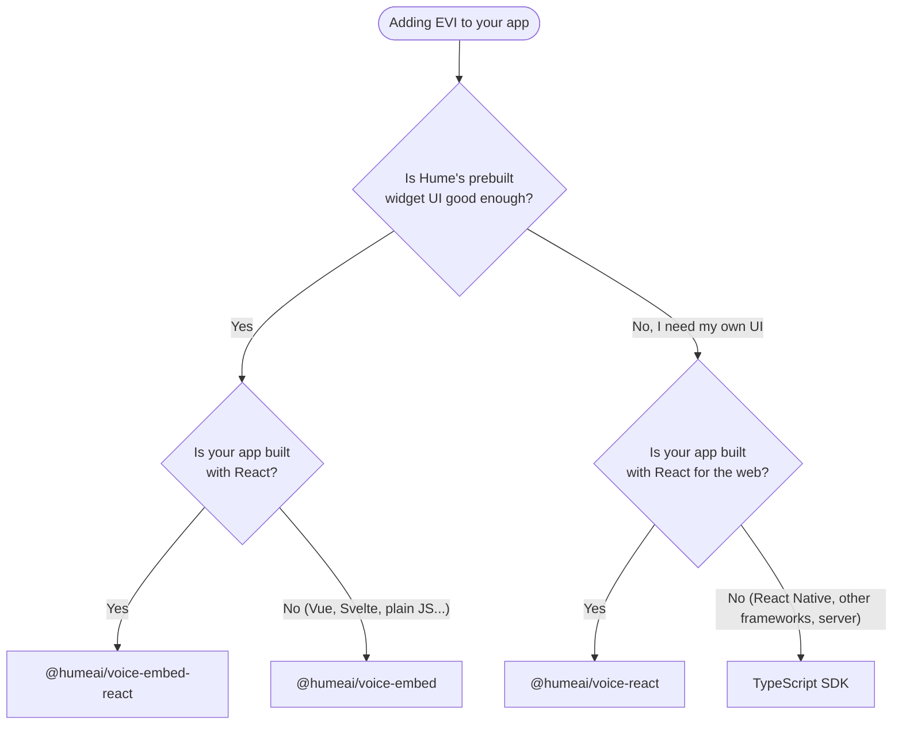

<div align="center">
  
  <h1>Hume React SDK</h1>
  <p>
    <strong>Integrate Hume AI in your React application</strong>
  </p>
</div>

## Getting started

This monorepo contains packages for adding Hume AI to your React applications.

| Package                                                                                              | Version                                                                                                                   | README                                                                                      | npm URL                                               | Supports                       |
| :--------------------------------------------------------------------------------------------------- | :------------------------------------------------------------------------------------------------------------------------ | :------------------------------------------------------------------------------------------ | :---------------------------------------------------- | :----------------------------- |
| [@humeai/voice-react](https://github.com/HumeAI/hume-react-sdk/tree/main/packages/react)             |              | [README](https://github.com/HumeAI/hume-react-sdk/tree/main/packages/react/README.md)       | <https://npmjs.com/package/@humeai/voice-react>       | Empathic Voice Interface (EVI) |
| [@humeai/voice-embed](https://github.com/HumeAI/hume-react-sdk/tree/main/packages/embed)             |              | [README](https://github.com/HumeAI/hume-react-sdk/tree/main/packages/embed/README.md)       | <https://npmjs.com/package/@humeai/voice-embed>       | Empathic Voice Interface (EVI) |
| [@humeai/voice-embed-react](https://github.com/HumeAI/hume-react-sdk/tree/main/packages/embed-react) |  | [README](https://github.com/HumeAI/hume-react-sdk/tree/main/packages/embed-react/README.md) | <https://npmjs.com/package/@humeai/voice-embed-react> | Empathic Voice Interface (EVI) |

## Which package should I use?

All three packages talk to the same [Empathic Voice Interface (EVI)](https://dev.hume.ai) API. They differ in **who owns the UI** and **which frameworks they support**.

### `@humeai/voice-react` — headless hooks, your UI

Ships no UI at all. `<VoiceProvider>` manages the EVI WebSocket, microphone capture, the audio playback queue, and message history; `useVoice()` exposes them as state and methods (`connect`, `disconnect`, `messages`, `mute`, `sendUserInput`, `sendSessionSettings`, `pauseAssistant`, and more). Companion hooks cover audio device selection (`useAudioDevices`) and mic/player FFT data (`useMicFft`, `usePlayerFft`) for building your own visualizations.

- **Best for:** a voice experience that matches your product's design, or that needs raw access to messages, tool calls, and prosody scores.
- **Trade-off:** you build and maintain the entire interface.
- **Requires:** React `>=18.2` in a bundled web app (Next.js, Vite, Webpack). Uses Web Audio and `getUserMedia`, so it does **not** run in React Native.

### `@humeai/voice-embed-react` — Hume's widget, as a React component

Renders Hume's prebuilt voice widget (hosted at `voice-widget.hume.ai`) inside an iframe, wrapped in an `<EmbeddedVoice />` component. You pass `auth` plus config, control visibility with the `isEmbedOpen` prop, and subscribe to transcripts via `onMessage` / `onClose`. The iframe owns the connection, microphone, and playback — there is no UI to build and nothing to style.

- **Best for:** adding a working voice agent to an existing React app in minutes.
- **Trade-off:** the widget's look and interaction model are Hume's, configurable but not replaceable.
- **Requires:** React `>=18.2`. This is a thin wrapper over `@humeai/voice-embed` — same widget, same behavior.

### `@humeai/voice-embed` — Hume's widget, framework-agnostic

The same iframe widget with an imperative API instead of a component: `EmbeddedVoice.create({ auth, ... })` returns a handle with `mount()`, `openEmbed()`, and an unmount callback. It has no React dependency, so it works in Vue, Svelte, Angular, or bundled vanilla-JavaScript applications that consume npm packages.

- **Best for:** non-React web apps, including bundled no-framework applications.
- **Trade-off:** same as above, plus you manage the mount/unmount lifecycle yourself.
- **Requires:** a browser DOM and an npm-aware build tool. If you are on React, prefer `@humeai/voice-embed-react`.

### Decision tree



### At a glance

|                            | `@humeai/voice-react`                   | `@humeai/voice-embed-react`   | `@humeai/voice-embed`       |
| :------------------------- | :-------------------------------------- | :---------------------------- | :-------------------------- |
| **Who owns the UI**        | You                                     | Hume                          | Hume                        |
| **Framework**              | React `>=18.2`                          | React `>=18.2`                | Any JS with a DOM           |
| **API shape**              | Provider + hooks                        | `<EmbeddedVoice />` component | `create()` / `mount()`      |
| **Where it runs**          | In your page                            | In an iframe                  | In an iframe                |
| **Visual customization**   | Complete                                | Widget config only            | Widget config only          |
| **Access to EVI messages** | Full (transcripts, tool calls, prosody) | Transcripts via `onMessage`   | Transcripts via `onMessage` |
| **Time to first call**     | Longest                                 | Shortest                      | Short                       |

Not using React? Check out our other SDKs:

- [TypeScript SDK](https://github.com/HumeAI/hume-typescript-sdk)
- [Python SDK](https://github.com/HumeAI/hume-python-sdk)

Or, integrate with the API directly

- [API Documentation](https://dev.hume.ai)

## One-click deploy templates

<table>
  <tr>
    <td>
      
    </td>
    <td>
     <strong><a href="https://github.com/humeai/hume-evi-next-js-starter">EVI Next.js Starter</a></strong>
     <p>
     A starter template for building an Empathic Voice Interface (EVI) using Next.js.
     </p>
     <a href="https://vercel.com/templates/ai/empathic-voice-interface-starter"></a>
    </td>
  </tr>
</table>

## Documentation

Guides and a generated API reference for every package are published at
<https://humeai.github.io/hume-react-sdk/>.

## Local development

This SDK is developed on Turborepo. Development requires Node `22.18` (see
`.nvmrc`) and pnpm `11.24`; the published packages themselves support Node
`>=18`.

```sh
pnpm install
pnpm dev
```

This starts the development server for each SDK package and each example
application. Copy the `.env.example` file in an example directory to
`.env.local` and fill in your Hume credentials before running it.

Useful commands:

| Command                  | What it does                                                                                                           |
| :----------------------- | :--------------------------------------------------------------------------------------------------------------------- |
| `pnpm dev`               | Watch-build every package and example                                                                                  |
| `pnpm dev:iframe`        | Watch-build the packages and the embed example only                                                                    |
| `pnpm test`              | Run the unit tests                                                                                                     |
| `pnpm docs:dev`          | Serve the documentation site locally                                                                                   |
| `pnpm api-report:update` | Regenerate the committed API reports after changing a public API                                                       |
| `pnpm check`             | Run the full gate: build, lint, typecheck, format, dependency, docs, dead-code, packaging, API-report, and test checks |

Run `pnpm check` before opening a pull request — CI runs the same set.

## Support

If you have questions or require assistance pertaining to this package, [reach out to us on Discord](https://hume.ai/discord)!
